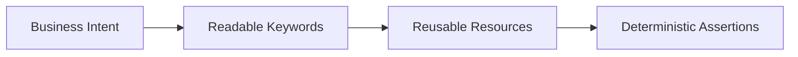

import RobotPlayground from '@site/src/components/RobotPlayground';

## What You Will Learn

- Why Robot Framework is optimized for readable, keyword-driven automation.
- How this book's run-edit-run workflow accelerates learning.
- How to read a minimal `.robot` file and validate expected behavior.

## Prerequisites

- Basic understanding of software testing concepts.
- No prior Robot Framework experience required.

## Real-World Scenario

A product team just moved from manual smoke checks to automation. They need tests that business stakeholders can read and engineers can maintain. This chapter introduces that collaboration-friendly approach.

## Concept Explanation

Robot Framework separates *test intent* from *implementation details*. Tests read like business steps while reusable keywords hide complexity.

## Example Files

- `main.robot`: one focused business test case.
- `resources/common.resource`: reusable keyword implementation.

## Editable Execution Block

<RobotPlayground chapterId="chapter-01-introduction" height={440} />

## Try It Yourself

1. Change the expected message in `main.robot` to a wrong value and run.
2. Observe the failure output and identify assertion details.
3. Fix the value and rerun until it passes again.

## Common Mistakes

- Treating tests as scripts instead of behavior descriptions.
- Writing implementation details directly in test cases.
- Ignoring clear assertion messages.

## Summary

You now understand the core loop of this book: read intent, inspect files, execute, and learn from output. This is the foundation for every advanced chapter.

## Next Steps

Continue to [02 - Installation Concepts](/docs/02-installation-concepts).

## Authoritative References

- [Robot Framework User Guide](https://robotframework.org/robotframework/latest/RobotFrameworkUserGuide.html)
- [Getting Started Testing Guide](https://docs.robotframework.org/docs/getting_started/testing)
