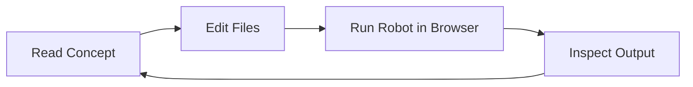

import RobotPlayground from '@site/src/components/RobotPlayground';

## Concept Explanation

Robot Framework is a keyword-driven test automation framework focused on readable test suites. This book pairs explanation with direct browser execution so you can see how each keyword behaves in real time.

## Example Files

This chapter uses `main.robot` and `resources/common.resource`.

## Editable Execution Block

<RobotPlayground chapterId="chapter-01-introduction" height={430} />

## Try It Yourself

Change the expected welcome message in `main.robot` and run the suite again.

## Common Mistakes

- Forgetting the `*** Test Cases ***` section header.
- Calling a keyword that is not imported from a resource file.

## Summary

You now have the core flow: load files, edit tests, execute, and inspect results.

## Next Steps

Continue to installation concepts and learn the execution model details.
