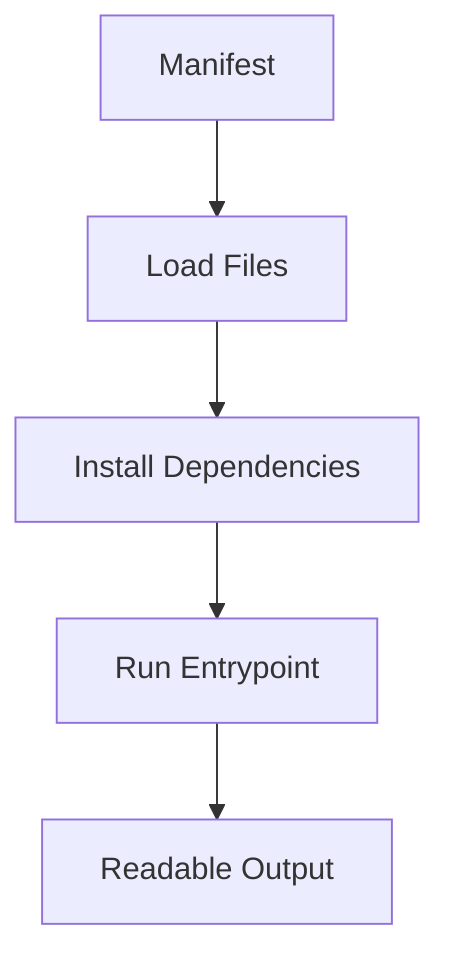

import RobotPlayground from '@site/src/components/RobotPlayground';

## What You Will Learn

- How Robot execution depends on Python packages and import paths.
- Why deterministic environments matter for stable automation.
- How chapter manifests define entrypoints and files.

## Prerequisites

- Completed [Chapter 01](/docs/01-introduction).
- Familiarity with the basic run/output cycle.

## Real-World Scenario

A team says "it works on my machine" because everyone uses different Python versions and packages. You need a predictable setup strategy that scales from laptop to CI.

## Concept Explanation

Automation quality starts with runtime consistency. In this book, each chapter declares exactly what is needed so execution is reproducible.

## Example Files

- `main.robot`: suite entrypoint.
- `resources/environment.resource`: environment validation keyword.
- `libraries/install_notes.py`: Python library keyword.

## Editable Execution Block

<RobotPlayground chapterId="chapter-02-installation-concepts" height={440} />

## Try It Yourself

1. Update the string returned by `Installation Tip` in `libraries/install_notes.py`.
2. Rerun and confirm output reflects the Python library change.
3. Reset and verify baseline behavior is restored.

## Common Mistakes

- Mixing resource imports and library imports incorrectly.
- Forgetting to keep entrypoint and folder structure aligned.
- Treating dependency management as a one-time setup task.

## Summary

You now understand how runtime reproducibility and manifest-driven execution prevent environment drift and flaky onboarding.

## Next Steps

Continue to [03 - Robot Framework Basics](/docs/03-robot-framework-basics).

## Authoritative References

- [Getting Started Testing Guide](https://docs.robotframework.org/docs/getting_started/testing)
- [Robot Framework Style Guide](https://docs.robotframework.org/docs/style_guide)
- [Robot Framework User Guide](https://robotframework.org/robotframework/latest/RobotFrameworkUserGuide.html)
