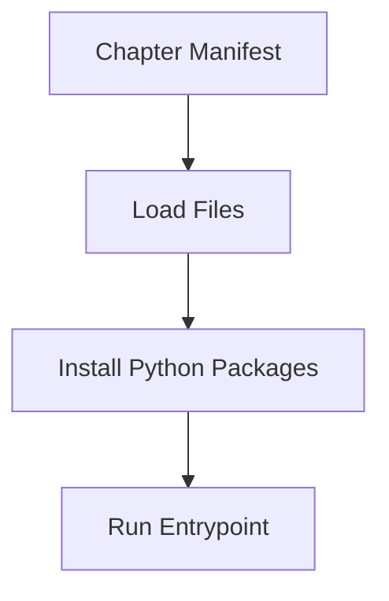

import RobotPlayground from '@site/src/components/RobotPlayground';

## Concept Explanation

Even when running in-browser, it helps to understand how Robot Framework depends on Python packages and file layout. This chapter explains dependency boundaries and suite entrypoints.

## Example Files

This chapter uses `main.robot`, `resources/environment.resource`, and `libraries/install_notes.py`.

## Editable Execution Block

<RobotPlayground chapterId="chapter-02-installation-concepts" height={430} />

## Try It Yourself

Update the environment keyword to print a different execution target.

## Common Mistakes

- Setting the wrong entrypoint in `manifest.json`.
- Mixing resource and library import syntax.

## Summary

You understand how chapter manifests connect files, dependencies, and execution.

## Next Steps

Move to Robot syntax and control flow basics.
