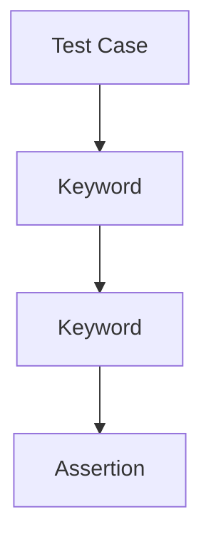

import RobotPlayground from '@site/src/components/RobotPlayground';

## Concept Explanation

Robot suites are built from settings, variables, keywords, and test cases. This chapter uses simple reusable keywords to keep test steps readable.

## Example Files

This chapter uses `suite.robot`, `resources/user_keywords.resource`, and `data/test_data.json`.

## Editable Execution Block

<RobotPlayground chapterId="chapter-03-robot-framework-basics" height={430} />

## Try It Yourself

Add one more validation step and verify output ordering.

## Common Mistakes

- Incorrect spacing in keyword arguments.
- Forgetting to import resource files in `*** Settings ***`.

## Summary

You can structure basic suites and express reusable steps with custom keywords.

## Next Steps

Next chapter introduces larger multi-file architecture patterns.
