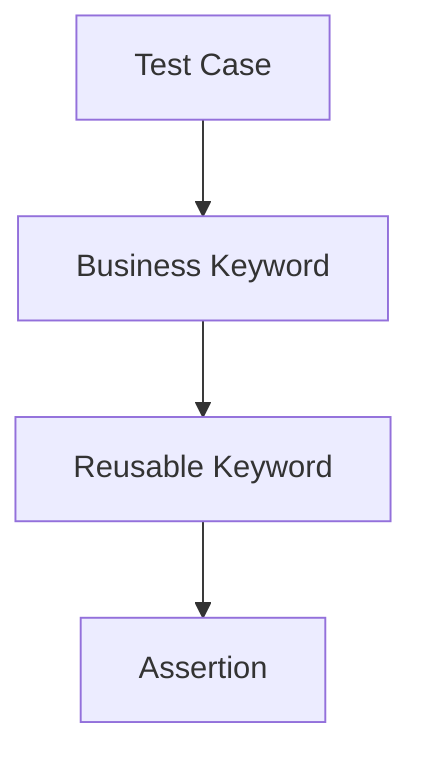

import RobotPlayground from '@site/src/components/RobotPlayground';

## What You Will Learn

- Core `.robot` structure: settings, test cases, and keywords.
- How to keep tests readable while centralizing reusable logic.
- How assertions communicate intent and failure causes.

## Prerequisites

- Completed chapters 01 and 02.

## Real-World Scenario

Your team has 40 smoke tests, but no shared structure. Every test case is written differently, making reviews and debugging expensive.

## Concept Explanation

Robot Framework is strongest when test cases are concise and keywords are reusable. Tests should describe behavior, not implementation mechanics.

## Example Files

- `suite.robot`: core suite file.
- `resources/user_keywords.resource`: reusable keyword definitions.
- `data/test_data.json`: externalized fixture data.

## Editable Execution Block

<RobotPlayground chapterId="chapter-03-robot-framework-basics" height={440} />

## Try It Yourself

1. Add one extra validation keyword call in `suite.robot`.
2. Keep keyword names business-readable.
3. Run and verify ordering and output clarity.

## Common Mistakes

- Large, procedural test cases with no reusable keywords.
- Weak keyword names like `Step1` and `DoStuff`.
- Assertions that do not explain expected business outcomes.

## Summary

You can now structure Robot suites in a maintainable way: concise tests, focused keywords, and clear assertions.

## Next Steps

Continue to [04 - Multi-file Architecture](/docs/04-multi-file-architecture).

## Authoritative References

- [Robot Framework User Guide](https://robotframework.org/robotframework/latest/RobotFrameworkUserGuide.html)
- [How to Write Robot Framework Tests](https://docs.robotframework.org/docs/getting_started/how_to_write_rf)
- [Robot Framework Style Guide](https://docs.robotframework.org/docs/style_guide)
