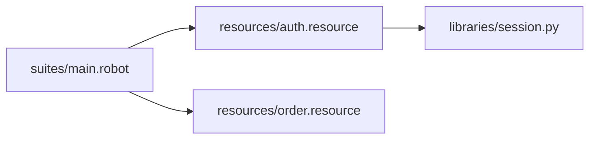

import RobotPlayground from '@site/src/components/RobotPlayground';

## Concept Explanation

Real automation projects split responsibilities across suites, resources, and libraries. This chapter introduces nested directories and cross-file imports.

## Example Files

This chapter uses `suites/main.robot`, two resource files, and nested Python helpers.

## Editable Execution Block

<RobotPlayground chapterId="chapter-04-multi-file-architecture" height={430} />

## Try It Yourself

Create a new keyword file under `resources/` and wire it into the suite.

## Common Mistakes

- Relative paths that break after folder refactors.
- Duplicating keywords across files instead of centralizing.

## Summary

You can organize multi-file suites and keep imports predictable.

## Next Steps

Advanced keyword composition comes next.
