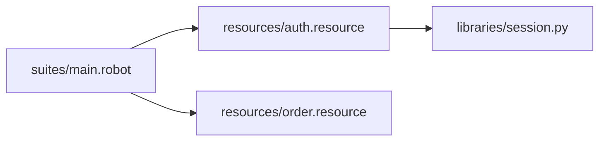

import RobotPlayground from '@site/src/components/RobotPlayground';

## What You Will Learn

- How to split suites, resources, and libraries into clear layers.
- How relative imports behave across nested folders.
- How to prevent architecture drift as suites grow.

## Prerequisites

- Completed chapters 01 to 03.

## Real-World Scenario

A monolithic `tests.robot` file became unmaintainable after six months. You need a structure where teams can add scenarios without breaking existing imports.

## Concept Explanation

Scalable Robot projects separate concerns:

- suites orchestrate business flows
- resources define reusable test language
- Python libraries hold code-heavy logic

## Example Files

- `suites/main.robot`: orchestrates end-to-end flow.
- `resources/auth.resource` and `resources/order.resource`: domain keywords.
- `libraries/session.py`: reusable Python helper.

## Editable Execution Block

<RobotPlayground chapterId="chapter-04-multi-file-architecture" height={440} />

## Try It Yourself

1. Add a new resource file under `resources/`.
2. Import it into `suites/main.robot`.
3. Add one keyword call and verify execution still passes.

## Common Mistakes

- Circular resource imports.
- Deep relative paths that become fragile during refactors.
- Mixing business orchestration and low-level implementation in one file.

## Summary

You now have a repeatable multi-file structure that supports maintainability and team collaboration.

## Next Steps

Continue to [05 - Advanced Keywords](/docs/05-advanced-keywords).

## Authoritative References

- [Robot Framework User Guide](https://robotframework.org/robotframework/latest/RobotFrameworkUserGuide.html)
- [Robot Framework Style Guide](https://docs.robotframework.org/docs/style_guide)
- [Standard Libraries Overview](https://robotframework.org/robotframework/#standard-libraries)
