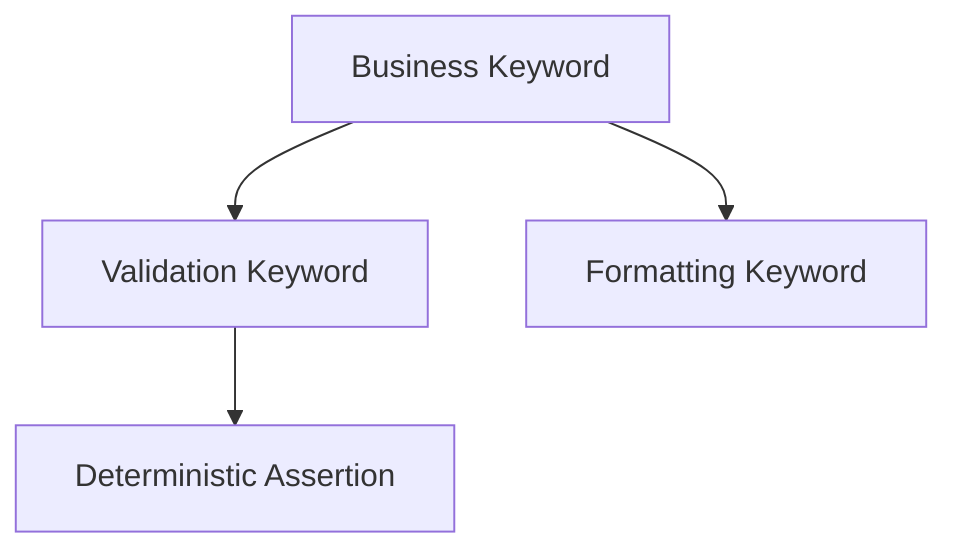

import RobotPlayground from '@site/src/components/RobotPlayground';

## What You Will Learn

- How to design keyword APIs that stay readable under change.
- How to separate orchestration keywords from assertion keywords.
- How to keep keyword scope small and test intent explicit.

## Prerequisites

- Completed chapters 01 to 04.

## Real-World Scenario

Regression failures are difficult to debug because each keyword performs multiple unrelated operations. You need composable keyword contracts.

## Concept Explanation

Advanced keywords improve maintainability when each keyword has a single responsibility and predictable inputs/outputs.

## Example Files

- `main.robot`: business-level scenario.
- `keywords/advanced.resource`: composable keyword logic.
- `resources/assertions.resource`: focused assertion helpers.

## Editable Execution Block

<RobotPlayground chapterId="chapter-05-advanced-keywords" height={440} />

## Try It Yourself

1. Add a new argument to `Build Greeting`.
2. Update the calling test case and keep name clarity.
3. Add one explicit assertion keyword for the new behavior.

## Common Mistakes

- Hiding critical assertions deep inside utility keywords.
- Long keywords that both arrange data and assert outcomes.
- Poor argument naming that obscures test intent.

## Summary

You can now compose behavior from small, intentional keywords that are easier to maintain, debug, and review.

## Next Steps

Continue to [06 - Python Integration](/docs/06-python-integration).

## Authoritative References

- [Robot Framework User Guide](https://robotframework.org/robotframework/latest/RobotFrameworkUserGuide.html)
- [Robot Framework Style Guide](https://docs.robotframework.org/docs/style_guide)
- [BDD Test Case Style (optional extension)](https://docs.robotframework.org/docs/testcase_styles/bdd)
