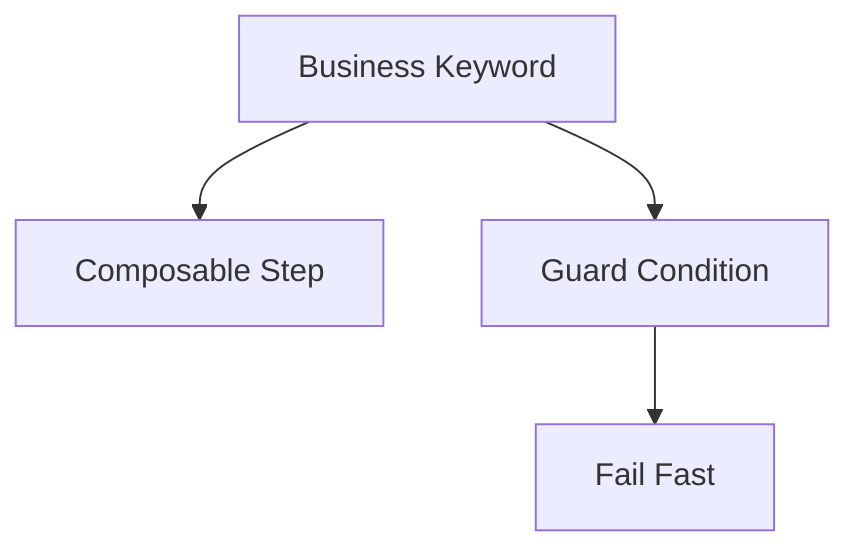

import RobotPlayground from '@site/src/components/RobotPlayground';

## Concept Explanation

Advanced keywords let you compose flows, handle failures, and reduce repetition. This chapter demonstrates layered keywords and argument-driven behavior.

## Example Files

This chapter includes `main.robot`, `keywords/advanced.resource`, and `resources/assertions.resource`.

## Editable Execution Block

<RobotPlayground chapterId="chapter-05-advanced-keywords" height={430} />

## Try It Yourself

Add a branch keyword that changes behavior based on a variable.

## Common Mistakes

- Hiding important assertions deep inside utility keywords.
- Creating keywords that perform too many unrelated actions.

## Summary

You can now design clearer keyword APIs for maintainable test suites.

## Next Steps

Next: Python integration for custom libraries.
