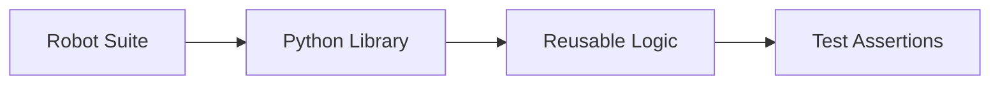

import RobotPlayground from '@site/src/components/RobotPlayground';

## Concept Explanation

Python libraries unlock custom logic and domain-specific helpers. This chapter shows how Robot imports Python modules and exposes methods as keywords.

## Example Files

This chapter uses `suites/python_integration.robot`, `libraries/math_lib.py`, and `libraries/string_lib.py`.

## Editable Execution Block

<RobotPlayground chapterId="chapter-06-python-integration" height={430} />

## Try It Yourself

Add a new Python method and call it as a keyword from Robot.

## Common Mistakes

- Using non-deterministic logic in library methods.
- Returning complex objects without clear assertion strategy.

## Summary

You can integrate Python libraries and expose robust custom keywords.

## Next Steps

Apply these patterns to scalable best practices.
