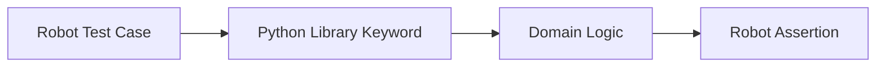

import RobotPlayground from '@site/src/components/RobotPlayground';

## What You Will Learn

- How Robot imports Python libraries and maps functions to keywords.
- How to keep custom Python logic deterministic and test-friendly.
- How to define clean handoffs between Robot steps and Python code.

## Prerequisites

- Completed chapters 01 to 05.
- Basic Python familiarity is helpful.

## Real-World Scenario

Your tests need domain-specific calculations and formatting rules that are awkward to express purely in `.robot` syntax. Python libraries become the right boundary.

## Concept Explanation

Use Robot for behavior expression and Python for complex logic. Keep Python helpers pure, predictable, and small.

## Example Files

- `suites/python_integration.robot`: orchestrates suite steps.
- `libraries/math_lib.py` and `libraries/string_lib.py`: Python keyword providers.
- `resources/python_keywords.resource`: validation keyword wrappers.

## Editable Execution Block

<RobotPlayground chapterId="chapter-06-python-integration" height={440} />

## Try It Yourself

1. Add one new Python helper function.
2. Call it from the Robot suite as a keyword.
3. Add a deterministic assertion for the returned value.

## Common Mistakes

- Returning inconsistent types from Python functions.
- Embedding random/time-dependent behavior in library keywords.
- Using Python helpers for behavior that belongs in readable Robot steps.

## Summary

You can now extend Robot Framework with Python while preserving readability and deterministic automation behavior.

## Next Steps

Continue to [07 - Best Practices](/docs/07-best-practices).

## Authoritative References

- [Robot Framework User Guide](https://robotframework.org/robotframework/latest/RobotFrameworkUserGuide.html)
- [Extending Robot Framework](https://docs.robotframework.org/docs/extending_robot_framework/custom-libraries/non-python_library)
- [Standard Libraries Overview](https://robotframework.org/robotframework/#standard-libraries)
