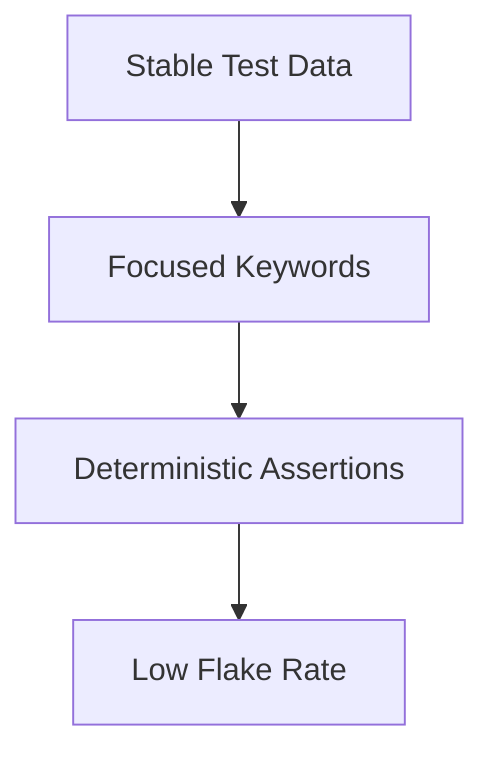

import RobotPlayground from '@site/src/components/RobotPlayground';

## What You Will Learn

- How to reduce flaky behavior through deterministic data and assertions.
- How to separate setup, action, and verification concerns.
- How naming and data organization improve long-term maintainability.

## Prerequisites

- Completed chapters 01 to 06.

## Real-World Scenario

The suite passes on one run and fails on the next, not because of product bugs, but due to unstable test data and mixed responsibilities in keywords.

## Concept Explanation

Stable automation comes from predictable inputs and explicit assertions. Keep data externalized and keyword behavior narrow.

## Example Files

- `main.robot`: stable scenario flow.
- `resources/best_practices.resource`: focused keyword set.
- `data/users.json` and `data/orders.json`: externalized data.

## Editable Execution Block

<RobotPlayground chapterId="chapter-07-best-practices" height={440} />

## Try It Yourself

1. Move one hardcoded value into JSON data.
2. Reference it from keyword logic.
3. Rerun and verify behavior is still deterministic.

## Common Mistakes

- Hardcoded values spread across many suites.
- Assertions that are too broad (for example, only checking status code).
- Overusing global variables for unrelated tests.

## Summary

You now have practical stability rules that directly improve reliability, debugging speed, and CI trust.

## Next Steps

Continue to [08 - Enterprise Patterns](/docs/08-enterprise-patterns).

## Authoritative References

- [Robot Framework Style Guide](https://docs.robotframework.org/docs/style_guide)
- [Flaky Test Guidance](https://docs.robotframework.org/docs/flaky_tests)
- [Variables Guide](https://docs.robotframework.org/docs/variables)
