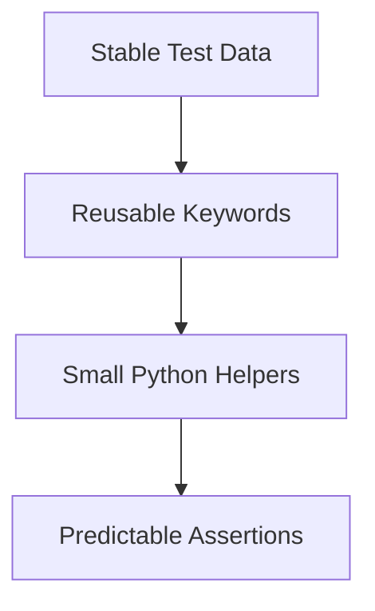

import RobotPlayground from '@site/src/components/RobotPlayground';

## Concept Explanation

Reliable automation depends on naming, layering, and deterministic data handling. This chapter packages practical rules into an executable example.

## Example Files

This chapter contains `main.robot`, `resources/best_practices.resource`, and supporting JSON data files.

## Editable Execution Block

<RobotPlayground chapterId="chapter-07-best-practices" height={430} />

## Try It Yourself

Refactor one long keyword into two smaller keywords and rerun.

## Common Mistakes

- Hardcoding values directly in many tests.
- Mixing setup and assertion logic in the same keyword.

## Summary

You now have operational rules for cleaner, more stable suites.

## Next Steps

Scale to enterprise patterns with layered suite architecture.
