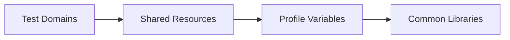

import RobotPlayground from '@site/src/components/RobotPlayground';

## What You Will Learn

- How to structure Robot projects for multi-team collaboration.
- How profile-based variables and shared resources prevent duplication.
- How to enforce consistency without slowing delivery.

## Prerequisites

- Completed chapters 01 to 07.

## Real-World Scenario

Multiple squads share one automation platform, but each team names files and variables differently. Onboarding is slow and maintenance cost keeps rising.

## Concept Explanation

Enterprise quality requires conventions that are explicit and repeatable:

- shared resource layers
- clear variable ownership
- reusable library contracts

## Example Files

- `suites/enterprise.robot`: top-level flow.
- `resources/shared.resource`: shared team keywords.
- `variables/profile.py` and `configs/env.yaml`: profile configuration.
- `libraries/profile_library.py`: profile-aware helper logic.

## Editable Execution Block

<RobotPlayground chapterId="chapter-08-enterprise-patterns" height={440} />

## Try It Yourself

1. Add a second profile value in `variables/profile.py`.
2. Use it in one keyword path.
3. Confirm output changes while structure remains readable.

## Common Mistakes

- Environment-specific values mixed directly into keyword files.
- Team-specific folder layouts that fragment standards.
- Shared resource files becoming unowned dumping grounds.

## Summary

You can now define enterprise-ready patterns that keep automation quality consistent across teams.

## Next Steps

Continue to [09 - Real-world Case Study](/docs/09-real-world-case-study).

## Authoritative References

- [Robot Framework User Guide](https://robotframework.org/robotframework/latest/RobotFrameworkUserGuide.html)
- [Variables Guide](https://docs.robotframework.org/docs/variables)
- [Robot Framework Style Guide](https://docs.robotframework.org/docs/style_guide)
