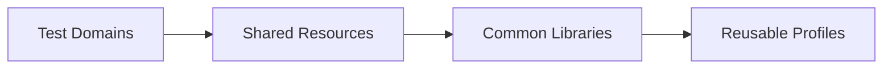

import RobotPlayground from '@site/src/components/RobotPlayground';

## Concept Explanation

Enterprise suites need consistent folder standards, shared resources, and execution profiles. This chapter introduces team-oriented structure and conventions.

## Example Files

This chapter includes `suites/enterprise.robot`, profile variables, and shared keyword libraries.

## Editable Execution Block

<RobotPlayground chapterId="chapter-08-enterprise-patterns" height={430} />

## Try It Yourself

Add a second execution profile and route one test to it.

## Common Mistakes

- Keeping environment-specific values in keyword files.
- Creating divergent folder structures across teams.

## Summary

You can structure large suites with predictable collaboration patterns.

## Next Steps

Use these patterns in a realistic case study.
