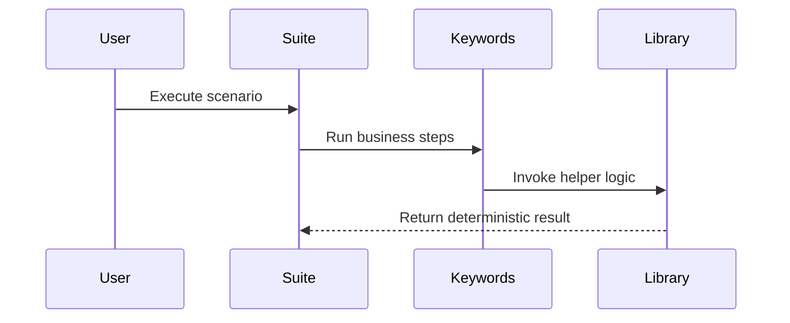

import RobotPlayground from '@site/src/components/RobotPlayground';

## Concept Explanation

This chapter models a practical user journey across auth, ordering, and reporting. The focus is traceability between business steps and automation components.

## Example Files

This chapter uses a multi-folder structure with suites, resources, and fixture data.

## Editable Execution Block

<RobotPlayground chapterId="chapter-09-real-world-case-study" height={430} />

## Try It Yourself

Change fixture values and confirm the output adapts to the new scenario.

## Common Mistakes

- Asserting implementation details instead of business outcomes.
- Overusing global variables across unrelated scenarios.

## Summary

You can map realistic scenarios to maintainable Robot components.

## Next Steps

Finish with the full capstone architecture.
