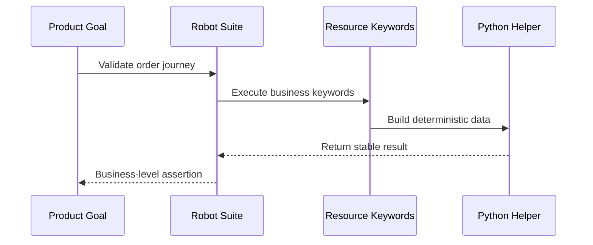

import RobotPlayground from '@site/src/components/RobotPlayground';

## What You Will Learn

- How to map business workflow steps into robust Robot scenarios.
- How to keep traceability between user intent, keywords, and helpers.
- How to validate outcomes instead of implementation details.

## Prerequisites

- Completed chapters 01 to 08.

## Real-World Scenario

You must automate a user journey across authentication and ordering. Stakeholders want confidence in business outcomes, not just technical smoke checks.

## Concept Explanation

A case-study approach keeps test design grounded in business value while preserving maintainable architecture.

## Example Files

- `suites/case_study.robot`: case-study flow.
- `resources/auth.resource` and `resources/orders.resource`: domain behavior.
- `libraries/case_helpers.py`: deterministic user helpers.
- `fixtures/case_data.json`: supporting scenario data.

## Editable Execution Block

<RobotPlayground chapterId="chapter-09-real-world-case-study" height={440} />

## Try It Yourself

1. Change fixture values to represent another user segment.
2. Update keyword expectations.
3. Verify the suite still reports business-meaningful output.

## Common Mistakes

- Over-asserting internal technical details.
- Business scenarios that rely on hidden global state.
- Test names that do not communicate business intent.

## Summary

You can now translate realistic product journeys into maintainable, traceable Robot automation.

## Next Steps

Continue to [10 - Final Capstone Project](/docs/10-final-capstone-project).

## Authoritative References

- [Robot Framework User Guide](https://robotframework.org/robotframework/latest/RobotFrameworkUserGuide.html)
- [BDD Style Guidance](https://docs.robotframework.org/docs/testcase_styles/bdd)
- [Flaky Test Guidance](https://docs.robotframework.org/docs/flaky_tests)
