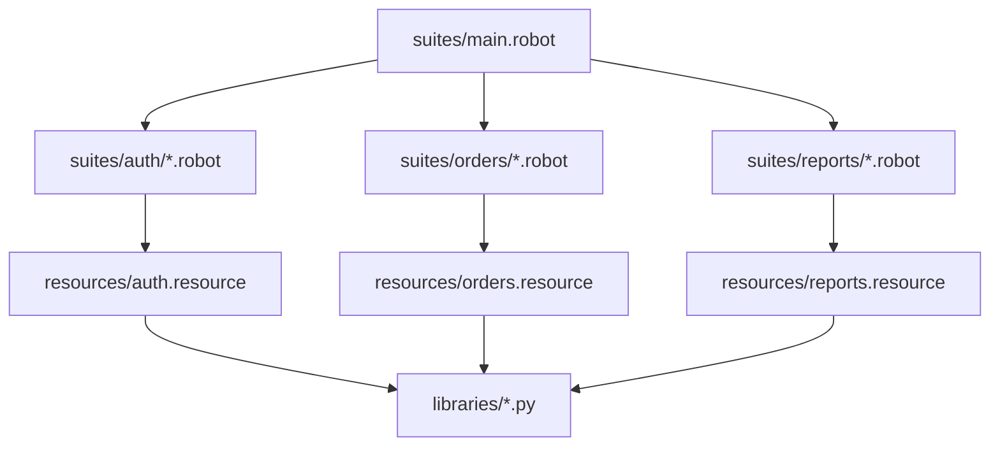

import RobotPlayground from '@site/src/components/RobotPlayground';

## Concept Explanation

The capstone combines all concepts into a nested, multi-domain project. It includes 20+ files, layered resources, Python helpers, variables, fixtures, and domain suites.

## Example Files

This chapter includes nested suites, resources, libraries, helpers, variables, fixtures, configs, and data assets.

## Editable Execution Block

<RobotPlayground chapterId="chapter-10-final-capstone-project" height={500} />

## Try It Yourself

Add one new end-to-end scenario under `suites/orders` and call it from `suites/main.robot`.

## Common Mistakes

- Breaking relative imports while moving files between folders.
- Letting shared resources become a dumping ground for unrelated keywords.

## Summary

You now have a production-style Robot project architecture you can evolve chapter by chapter.

## Next Steps

Use this capstone as a base for your own domain automation suite and integrate it with CI.
