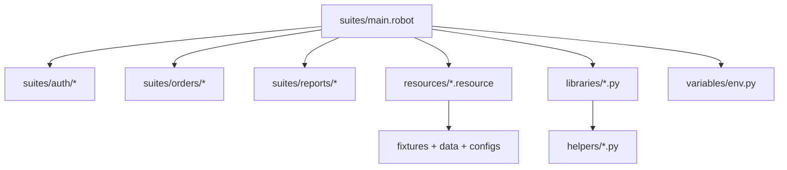

import RobotPlayground from '@site/src/components/RobotPlayground';

## What You Will Learn

- How to orchestrate a large multi-folder Robot project end-to-end.
- How to combine resources, libraries, variables, helpers, and fixtures.
- How to evolve this baseline into your own team's automation architecture.

## Prerequisites

- Completed chapters 01 to 09.

## Real-World Scenario

You are asked to deliver a maintainable automation baseline for a product squad. It must support growth, team handoff, CI execution, and clear ownership boundaries.

## Concept Explanation

The capstone mirrors a production project shape. The suite entrypoint composes focused domain files instead of accumulating all logic in one place.

## Example Files

This chapter contains 20+ files across:

- `suites/`
- `resources/`
- `keywords/`
- `libraries/`
- `helpers/`
- `variables/`
- `data/` and `fixtures/`
- `configs/`

## Editable Execution Block

<RobotPlayground chapterId="chapter-10-final-capstone-project" height={520} />

## Try It Yourself

1. Add a new business scenario under `suites/orders/`.
2. Create or reuse supporting keywords under `resources/`.
3. Keep assertions explicit and business-facing.
4. Confirm the full flow still passes.

## Common Mistakes

- Letting `main.robot` become a dumping ground.
- Cross-importing resources in ways that hide ownership.
- Creating Python helpers without deterministic contracts.

## Summary

You now have a practical, production-style Robot Framework blueprint that can serve as a starting point for real team automation.

## Next Steps

1. Adapt this structure to your product's domain boundaries.
2. Connect execution to your CI pipeline and reporting stack.
3. Keep your conventions aligned with authoritative Robot Framework guidance.

## Authoritative References

- [Robot Framework User Guide](https://robotframework.org/robotframework/latest/RobotFrameworkUserGuide.html)
- [Robot Framework Style Guide](https://docs.robotframework.org/docs/style_guide)
- [Parallel Execution Guidance](https://docs.robotframework.org/docs/parallel)
- [CI / Docker Guidance](https://docs.robotframework.org/docs/using_rf_in_ci_systems/docker)
